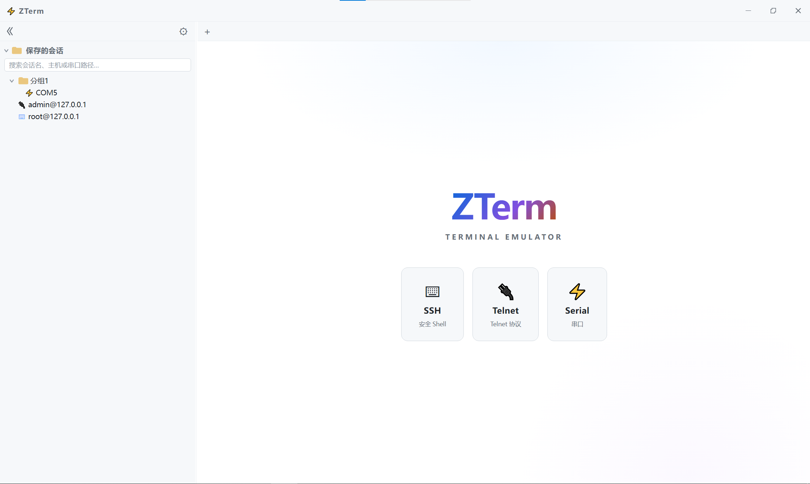
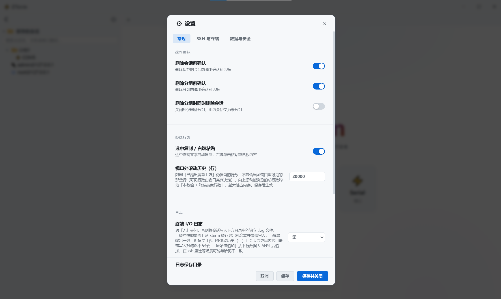
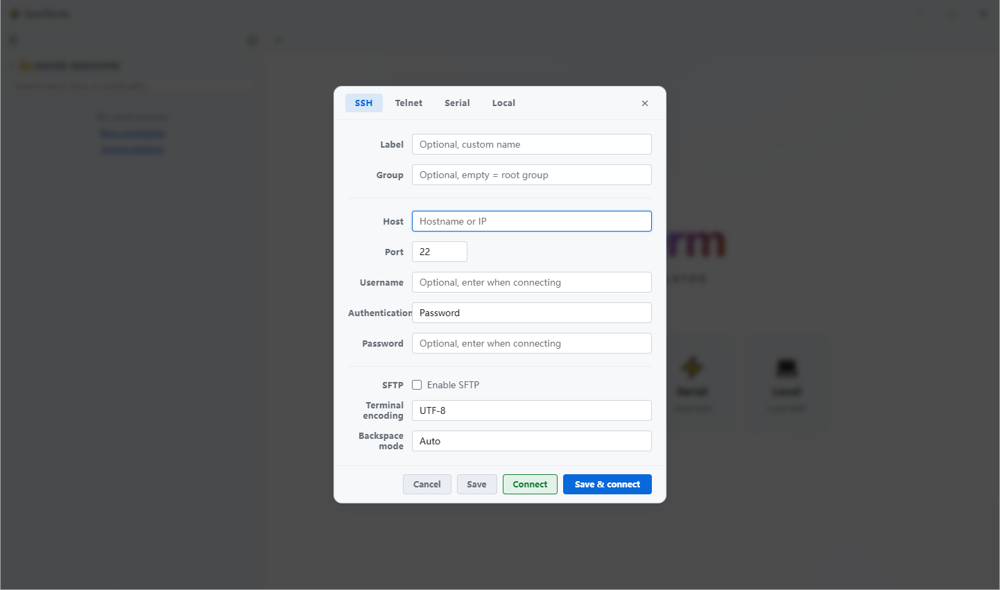

# ZTerm

**[简体中文](README.zh-CN.md)** · English · v3.2.4

ZTerm is a cross-platform desktop terminal emulator built with **Electron**, **React**, and **xterm.js**. It supports **SSH**, **SFTP**, **Telnet**, and **Serial** connections, with saved sessions, hierarchical grouping, encrypted credential storage, and a polished custom UI (frameless window, dark/light themes, bilingual interface).

---

## Table of Contents

- [Features](#features)
- [Keyboard Shortcuts](#keyboard-shortcuts)
- [Screenshots](#screenshots)
- [Tech Stack](#tech-stack)
- [Project Structure](#project-structure)
- [Requirements](#requirements)
- [Quick Start](#quick-start)
- [Development & Quality](#development--quality)
- [Build & Release](#build--release)
- [Import / Export Format](#import--export-format)
- [Security Model](#security-model)
- [Data & Storage Locations](#data--storage-locations)
- [Troubleshooting](#troubleshooting)
- [License](#license)

---

## Features

### Connection types


| Protocol   | Description                                                                                                                                  |
| ---------- | -------------------------------------------------------------------------------------------------------------------------------------------- |
| **SSH**    | Interactive shell over SSH (`ssh2`), PTY resize, password or private-key auth, configurable KEX/cipher/MAC algorithms                        |
| **SFTP**   | File browser in the sidebar: list, upload, download, mkdir, rename, delete; progress events; local paths restricted to safe user directories |
| **Telnet** | Raw TCP Telnet client                                                                                                                        |
| **Serial** | Local serial ports via `serialport` (baud rate, data/stop bits, parity); port list must be chosen from enumerated devices                    |


### Session management

- Save sessions with **label**, **group** (hierarchical paths), and connection parameters
- **Empty group placeholders** — create folder-like groups before adding sessions
- **Search** saved sessions by name, host, or serial path (**Ctrl/Cmd+F**)
- **Duplicate**, **rename**, **edit**, **delete** sessions; optional confirm dialogs
- **Export / import** session lists (JSON envelope, v1); import from **Settings** or the **sidebar**
- **Connect**, **Save & connect**, or **Save only** from the connection dialog
- **Credential prompt** on connect when secrets are not stored; optional **“Save & connect”** to update vault

### Terminal experience

- **xterm.js** with Fit addon, Web Links addon, Search addon, configurable scrollback (0–500,000 lines)
- **In-terminal search**: incremental find with match highlighting; **case sensitive**, **whole word**, and **regex** modes; prev/next navigation; open via tab context menu or **Ctrl/Cmd+Shift+F**
- **Character encodings**: UTF-8, GBK, GB18030, GB2312, Big5, UTF-16 LE, Latin-1 (via `iconv-lite` in the main process)
- **Backspace mode** (per session): Auto (DEL for SSH, BS for Telnet/Serial), or force DEL / BS
- **Terminal interaction**: select-to-copy and right-click paste (toggle in settings)
- **Output highlighting**: regex rules with colors (defaults for error/success/warning/IP)
- **Tab bar**: new connection, close tab/others/left/right/all, clear screen, save terminal output to file
- **Session logging**: off, buffer (matches screen), or stream (raw downstream, ANSI stripped); log path validated against allowed directories

### UI & i18n

- Custom **frameless title bar** (minimize / maximize / close)
- **Dark**, **light**, or **auto** theme (follows OS); **live preview** in Settings before saving
- **UI language**: English, 简体中文, or auto (follows system)
- Resizable **sidebar** for saved sessions and SFTP tree
- **Settings dialog** organized into General, SSH & Terminal, and Data & Security tabs

### Security-related behavior

- Renderer runs with **context isolation**, **sandbox**, no Node integration
- IPC limited to **trusted** main-window senders
- **SSH host key verification** (known-hosts style, `userData/zterm-known-hosts.json`); prompts on first connect and fingerprint change
- **Weak SSH algorithms** flagged in settings; modern defaults exclude legacy CBC / SHA-1 / `ssh-rsa` where possible
- Optional **encrypted vault** for passwords and keys (`safeStorage` when available)
- **Local path policy** for logs and SFTP: home, Documents, Downloads, Desktop, Music/Pictures/Videos, userData; on Windows, non-system drive roots (e.g. `D:\`) are also allowed

---

## Keyboard Shortcuts

Global shortcuts work when ZTerm is focused. On macOS use **Cmd**; on Windows and Linux use **Ctrl**.


| Shortcut | Action |
| -------- | ------ |
| **Ctrl/Cmd+F** | Focus sidebar **saved session search** (expands the session list if collapsed) |
| **Ctrl/Cmd+Shift+F** | Open **in-terminal search** on the active tab |
| **Enter** / **Shift+Enter** | Next / previous match (in terminal search bar) |
| **Esc** | Close terminal search bar |

---

## Screenshots







---

## Tech Stack


| Layer         | Technology                                 |
| ------------- | ------------------------------------------ |
| Desktop shell | Electron 42                                |
| Language      | TypeScript                                 |
| UI            | React 19, Vite 8                           |
| Terminal      | @xterm/xterm 5, Fit / Web Links / Search addons |
| SSH / SFTP    | ssh2                                       |
| Serial        | serialport 12                              |
| Encoding      | iconv-lite                                 |
| Testing       | Vitest 3                                   |
| Packaging     | electron-builder                           |


---

## Project Structure

Source code is organized as **frontend / backend / shared**:

| Directory | Role | Description |
|-----------|------|-------------|
| **`src/`** | Frontend | React renderer: UI, xterm, localStorage, consumes `window.zterm` |
| **`electron/`** | Backend | Main process + workers: IPC, files/dialogs, credentials, ssh2/SFTP, serial |
| **`shared/`** | Shared | IPC types, API contract, algorithm defaults, UI-agnostic utilities |

```
zterm/
├── src/                                 # Frontend (renderer)
│   ├── main.tsx, App.tsx
│   ├── components/                      # Title bar, sidebar, terminal, SFTP, connect/settings dialogs
│   ├── store/                           # sessionStore, settingsStore, credentialsBridge
│   ├── lib/                             # Import/export, IPC helpers, session/terminal/settings logic
│   ├── hooks/, context/, i18n/, theme/, styles/, types/
│
├── electron/                            # Backend (main process + workers)
│   ├── main.ts                          # App entry, registers handlers
│   ├── preload.ts                       # contextBridge → window.zterm (built as preload.cjs)
│   ├── handlers/                        # ssh / sftp / telnet / serial / credentials / app / window / log
│   ├── workers/                         # sshSessionWorker, sftpSessionWorker
│   ├── lib/                             # IPC responses, path policy, known_hosts, SSH config, file dialogs, …
│   ├── i18n/                            # Main-process native dialog strings
│   └── types/
│
├── shared/                              # Shared (types, contract, pure functions)
│   ├── ipc.ts, zterm-api.d.ts
│   ├── sshAlgorithmDefaults.ts, terminalEncoding.ts, privateKeyMaterial.ts, …
│
├── tests/                               # Vitest unit tests (tests/**/*.test.ts)
├── tsconfig/                            # TypeScript configs (see tsconfig/README.md)
├── scripts/                             # build-electron.ts, after-pack.cjs
├── .github/workflows/                   # ci.yml (auto checks), release.yml (manual packaging)
├── docs/images/                         # README screenshots
├── build/                               # App icons
├── index.html, vite.config.ts, vitest.config.ts, eslint.config.ts
├── tsconfig.json                        # IDE entry, extends tsconfig/tsconfig.json
└── package.json
```

**Runtime data flow (simplified):**

```
Frontend src/ (React / xterm)
    │  window.zterm.* (preload.cjs)
    ▼
Backend electron/ (handlers + lib)
    │  worker threads (SSH / SFTP)
    ▼
Remote host / local serial / OS keychain (safeStorage)

shared/* ── used by frontend and backend (IPC types, algorithms, encodings, error codes)
```

**Dev/build output:** backend TypeScript compiles to `dist-electron/`; frontend Vite builds to `dist/`. Electron loads `dist-electron/electron/main.js` at runtime, not `electron/*.ts` source files.

---

## Requirements

- **Node.js** 18+ (LTS recommended; CI uses Node 22)
- **npm** 9+
- **Platform build tools** (for native modules):
  - **macOS**: Xcode Command Line Tools
  - **Windows**: Visual Studio Build Tools, Python (for `node-gyp`)
  - **Linux**: `build-essential`, `libudev-dev` (for Serial)

---

## Quick Start

```bash
# GitHub
git clone https://github.com/zhuhezhang/zterm.git
cd zterm

# or Gitee
# git clone https://gitee.com/zhuhezhang/zterm.git
# cd zterm

npm install
npm run dev
```

This starts **Vite** (port **5173**) and the **Electron** dev pipeline: `electron/` is compiled by `tsc -w` into `dist-electron/`, nodemon watches the output and restarts the main process; `src/` hot-reloads via Vite.

| Script | Description |
| --- | --- |
| `npm run dev:silent` | Same as `dev`, suppresses Electron security warnings |
| `npm run dev:renderer` | Vite only |
| `npm run dev:electron` | Electron only (expects Vite on 5173) |
| `npm run build:main` | Compile backend only → `dist-electron/` |

---

## Development & Quality

Before merging, run locally (aligned with GitHub Actions `ci.yml`):

```bash
npm run typecheck   # four tsconfigs: frontend, backend, preload, tooling
npm run lint
npm run test        # Vitest, tests/**/*.test.ts
```

| Script | Description |
| --- | --- |
| `npm run test:watch` | Run tests in watch mode |
| `npm run test:coverage` | Coverage for src/lib, shared, electron/lib |

---

## Build & Release

```bash
npm run build              # current platform → release/ (e.g. NSIS + portable + zip on Windows)
npm run build:win:x64      # Windows x64 only
npm run build:linux:x64    # Linux x64 only
npm run build:mac:universal
```

**GitHub Actions** (see `.github/workflows/README.md`):

- **`ci.yml`**: typecheck, lint, test on push/PR
- **`release.yml`**: manual packaging; optional `github_release_all` builds Win+Linux+macOS and publishes a GitHub Release


---

## Import / Export Format

Exported **sessions** and **settings** use a versioned JSON envelope (max file size **8 MB**):

```json
{
  "ztermExport": "sessions",
  "version": 1,
  "exportedAt": "Mon May 19 2026 ...",
  "data": [ /* session objects or settings object */ ]
}
```

- `ztermExport` must be `"sessions"` or `"settings"` (cross-import is rejected).
- `version` must be `1`.
- Unknown settings keys are stripped on import; invalid sessions are skipped with a summary alert.
- Session imports are capped at **99999** entries per file (see `src/lib/import/constants.ts`).

---

## Security Model

1. **Process separation**: Network and filesystem access run in the main process and worker threads; the renderer only calls whitelisted IPC via `preload.cjs`.
2. **Trusted IPC**: Window control, logging, and credential APIs reject senders that are not the registered main window.
3. **SSH MITM mitigation**: Host keys are recorded; unknown or changed fingerprints require user confirmation in a native dialog.
4. **Algorithm hygiene**: Defaults prefer modern AEAD ciphers and EtM MACs; legacy options remain selectable for old equipment but are marked weak in the UI.
5. **Path sandboxing**: Session logs and SFTP local paths must resolve under allowed user folders, app `userData`, or (Windows) non-system drive roots; denials return structured `SFTP_ERROR` codes mapped to i18n in the renderer.
6. **Serial safety**: Connect only accepts paths returned by `listPorts` (refreshed list), reducing arbitrary device open attempts.

This app is a convenience tool, not a full security audit. Review your threat model before storing production keys in the vault.

---

## Data & Storage Locations


| Data                        | Location                                                |
| --------------------------- | ------------------------------------------------------- |
| Saved sessions (no secrets) | `localStorage` → `zterm_saved_sessions`                 |
| Empty group placeholders    | `localStorage` → `__zterm_group_placeholders__`         |
| App settings                | `localStorage` → `zterm_settings`                       |
| SSH known hosts             | `{userData}/zterm-known-hosts.json` (pretty JSON, full rewrite) |
| Encrypted credentials       | `{userData}/zterm-credentials-vault.json` + OS `safeStorage` |
| Session logs                | User-configured or `Downloads/zterm-session-log/`       |

localStorage is managed by Chromium; `zterm-known-hosts.json` and `zterm-credentials-vault.json` rewrite the entire file when trust/sync actions occur.


Typical `userData` paths:

- **macOS**: `~/Library/Application Support/zterm/`
- **Windows**: `%APPDATA%\zterm\`
- **Linux**: `~/.config/zterm/`

---

## Troubleshooting


| Issue                                                                                                                                                                               | Suggestions                                                                                                                                                                                                                                                                                                                                                           |
| ----------------------------------------------------------------------------------------------------------------------------------------------------------------------------------- | --------------------------------------------------------------------------------------------------------------------------------------------------------------------------------------------------------------------------------------------------------------------------------------------------------------------------------------------------------------------- |
| `npm install` fails on `serialport`                                                                                                                                                 | Install platform build tools; on Linux install `libudev-dev`                                                                                                                                                                                                                                                                                                          |
| SSH algorithm mismatch                                                                                                                                                              | Open Settings → SSH & Terminal → algorithms; enable legacy KEX/cipher required by the server                                                                                                                                                                                                                                                                          |
| Garbled Chinese output                                                                                                                                                              | Set session encoding to **GBK** or **GB18030**                                                                                                                                                                                                                                                                                                                        |
| SFTP “path not allowed”                                                                                                                                                             | Choose a directory under Downloads/Documents/home, not system paths                                                                                                                                                                                                                                                                                                   |
| Serial port not listed                                                                                                                                                              | Click **Refresh**; on Linux ensure user is in `dialout` group                                                                                                                                                                                                                                                                                                         |
| Host key prompt every time                                                                                                                                                          | Check write permissions for `userData`; do not run from read-only profiles                                                                                                                                                                                                                                                                                            |
| Import fails / wrong file type                                                                                                                                                      | Use the correct export file (`sessions` vs `settings`); max 8 MB                                                                                                                                                                                                                                                                                                      |
| Changes under `electron/` not applied                                                                                                                                             | Ensure `npm run dev` is running and `tsc -w` recompiled; type `rs` in nodemon; or run `npm run build:main`                                                                                                                                                                                                                                                            |
| Windows portable `ZTerm x.x.x.exe` shows the wrong icon in File Explorer, but **Properties** shows the correct icon; `release\win-unpacked\ZTerm.exe` and `ZTerm Setup x.x.x.exe` look fine | The icon is embedded in the EXE; this is usually the Windows Shell **icon cache** (common when rebuilding the same portable file name). Copy and rename the file (e.g. `ZTerm-test.exe`) to verify. If that fixes it, restart `explorer.exe`, delete `iconcache`* and `thumbcache*` under `%LocalAppData%\Microsoft\Windows\Explorer\`, then open File Explorer again |


---

## License

[MIT License](LICENSE) — Copyright © 2026 [zhuhezhang](https://github.com/zhuhezhang)

---

**中文文档：** [README.zh-CN.md](README.zh-CN.md)