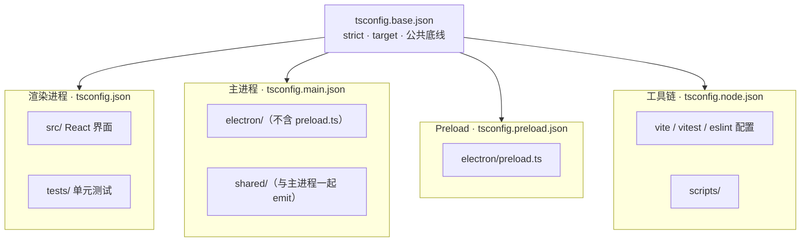

# TypeScript 配置说明

本目录集中存放 ZTerm 的全部 `tsconfig*.json`（五个文件）。配置文件内的 `include`、`paths`、`outDir`、`rootDir` 等路径均**相对于本目录**书写，因此指向源码时使用 `../` 回到项目根目录。

项目根目录另有一个 `[../tsconfig.json](../tsconfig.json)`，仅含 `"extends": "./tsconfig/tsconfig.json"`，供 Cursor / VS Code 自动发现渲染进程配置；不参与额外编译规则。

## 文件一览


| 文件                                                 | 用途                                         | 谁在用                               |
| -------------------------------------------------- | ------------------------------------------ | --------------------------------- |
| `[tsconfig.base.json](./tsconfig.base.json)`       | 公共编译选项（`strict`、`target` 等）                | 被其余四个配置 `extends`                 |
| `[tsconfig.json](./tsconfig.json)`                 | **渲染进程**：React / Vite / 单元测试               | IDE 类型提示、`npm run typecheck` 第一项  |
| `[tsconfig.main.json](./tsconfig.main.json)`       | **Electron 主进程** + `shared/` 编译输出          | `tsc -p` 开发 watch、生产 `build:main` |
| `[tsconfig.preload.json](./tsconfig.preload.json)` | **Preload** 类型检查（实际打包由 esbuild）            | `npm run typecheck`               |
| `[tsconfig.node.json](./tsconfig.node.json)`       | **构建工具链**：Vite / Vitest / ESLint / scripts | `npm run typecheck`               |


## 为何拆成多个文件？

ZTerm 是 Electron 应用，源码并非跑在同一个 JavaScript 运行时里。把全部 `.ts` 丢进一个 `tsconfig.json`，TypeScript 只能选**一套** `module` / `moduleResolution` / `lib` / `jsx` / `noEmit` 规则——而这几套代码的打包方式、可用 API、是否产出文件都互不相同，合并后必然有一部分目录类型检查失败，或 IDE 提示与真实构建行为不一致。

下面按「运行环境 → 规则冲突 → 打包链路 → 目录边界 → 若强行合并会怎样」说明拆分原因。

### 四种运行环境，四套规则




| 环境      | 配置文件                    | 实际跑在哪                  | 谁负责打包               | tsc 是否 emit          |
| ------- | ----------------------- | ---------------------- | ------------------- | -------------------- |
| 渲染进程    | `tsconfig.json`         | Chromium 渲染器（浏览器）      | Vite                | 否（`noEmit: true`）    |
| 主进程     | `tsconfig.main.json`    | Node.js（Electron main） | `tsc`               | 是 → `dist-electron/` |
| Preload | `tsconfig.preload.json` | 隔离的渲染上下文（桥接层）          | esbuild（CJS `.cjs`） | 否（仅类型检查）             |
| 工具链     | `tsconfig.node.json`    | 开发机上的 Node（跑配置与脚本）     | 不打包进应用              | 否                    |


`npm run typecheck` 会**依次**用上述四套配置各跑一遍 `tsc --noEmit`（主进程那套在 typecheck 时同样加 `--noEmit`，与日常 watch 编译区分开）。CI 与本地用同一入口，保证每个环境都被检查到。

注：emit = tsc 要不要把 TypeScript 编译成 JavaScript 写到磁盘上。

### 1. 模块解析规则无法统一

TypeScript 的 `moduleResolution` 决定 `import` 如何解析到文件、是否要求 `.js` 扩展名、如何处理 `package.json` 的 `"exports"` 等。ZTerm 里至少有两种互斥策略：


| 策略                              | 使用方         | 原因                                                    |
| ------------------------------- | ----------- | ----------------------------------------------------- |
| `bundler` + `module: ESNext`    | 渲染进程、工具链    | 代码交给 Vite / Vitest 打包，由 bundler 解析路径与扩展名              |
| `NodeNext` + `module: NodeNext` | 主进程、Preload | 主进程以 Node ESM 直接运行编译产物，须遵守 Node 的模块解析与 `**.js` 后缀**约定 |


主进程里的典型写法（编译后 Node 按 ESM 加载）：

```ts
import type { SshConnectConfig } from '../../shared/zterm-api.js'
```

渲染进程里同类文件往往不带 `.js` 后缀，且可走 `@/` 别名：

```ts
import type { IpcResult } from '../../shared/ipc'
import { something } from '@/lib/foo'
```

若只用一套 `NodeNext` 检查 `src/`，bundler 侧的 import 习惯会报多余错误；若只用 `bundler` 检查 `electron/`，则无法在主进程开发阶段发现 Node ESM 路径问题。因此 `**tsconfig.json` 显式 `exclude: ["../electron"]**`，与主进程配置各管各的目录。

#### 术语：`bundler` 与 `moduleResolution: "bundler"`

文中 **bundler** 有两层含义，不要混为一谈：


| 层面               | 含义                                                                                                                                           | ZTerm 中的对应                                                |
| ---------------- | -------------------------------------------------------------------------------------------------------------------------------------------- | --------------------------------------------------------- |
| **打包工具（日常说法）**   | 把许多 `.ts` / `.tsx` / `.css` 等打成浏览器或 Node 能加载的少量 JS 的工具                                                                                       | 渲染进程用 **Vite**；Preload 用 **esbuild**；测试由 **Vitest** 走类似解析 |
| **tsconfig 选项值** | `compilerOptions.moduleResolution` 设为 `"bundler"`，告诉 TypeScript：**这段代码的 `import` 最终会交给打包工具处理**，类型检查应按 bundler 的解析习惯来，而不是按 Node 直接跑 `.js` 的规则 | `tsconfig.json`、`tsconfig.node.json`                      |


渲染进程里的相关配置：

```json
"module": "ESNext",
"moduleResolution": "bundler",
"allowImportingTsExtensions": true,
"noEmit": true
```

**打包工具会替你处理的事**（所以 TypeScript 用 `bundler` 模式去「对齐」这些写法）：

- 路径别名（如 `@/` → `src/`，须与 `vite.config.ts` 的 `resolve.alias` 一致）
- `import` 可省略 `.js` / `.ts` 后缀
- 可直接 `import './foo.ts'`（配合 `allowImportingTsExtensions`）
- 把依赖打进一个或几个 bundle，运行时不再按 Node 规则逐个找文件

`bundler` 与 `NodeNext` 对同一仓库的不同要求：


|             | `moduleResolution: "bundler"`                | `moduleResolution: "NodeNext"`                      |
| ----------- | -------------------------------------------- | --------------------------------------------------- |
| 假设的运行方式     | 先经 Vite 等打包，再进浏览器                            | Node 直接 `import` 编译后的 `.js`                         |
| 典型 `import` | `from '@/lib/foo'`、`from '../../shared/ipc'` | `from '../../shared/zterm-api.js'`（ESM 常须 `.js` 后缀） |
| 本项目的使用范围    | `src/`、`tests/`、配置文件                         | `electron/` 主进程、Preload                             |


因此 README 和表格里写的「交给 Vite / Vitest 打包，由 bundler 解析」= **真实构建由 Vite 等完成**；tsconfig 里的 `"bundler"` 是让 `tsc` 类型检查与这套构建方式一致，避免前端代码被当成 Node 模块去报错。主进程没有 bundler 这一层，仍由 `tsc` 直接 emit，故用 `NodeNext`。

**注:**  ESNext ≈ 用最新的 `import` / `export` 写法，给 bundler（Vite）去打包；NodeNext ≈ 这段代码最后是给 Node 直接跑的，import 必须像 Node 一样合法。

### 2. 类型库（`lib`）与 JSX 不同


| 配置                      | `lib`                           | `jsx`       | 含义                                                     |
| ----------------------- | ------------------------------- | ----------- | ------------------------------------------------------ |
| `tsconfig.json`         | `ES2022`, `DOM`, `DOM.Iterable` | `react-jsx` | 界面代码可使用 `window`、`document` 等浏览器 API                   |
| `tsconfig.main.json`    | `ES2022`                        | （无）         | 主进程不应误用 DOM；类型以 Node + Electron 为准                     |
| `tsconfig.preload.json` | `ES2022`, `DOM`                 | （无）         | Preload 同时接触 `contextBridge`（Electron）与页面侧契约，需要 DOM 类型 |
| `tsconfig.node.json`    | `ES2022`                        | （无）         | 构建脚本只需标准 ECMAScript + `@types/node`                    |


给主进程加上 `DOM` 会让 Node 代码「合法」地访问浏览器全局对象，掩盖环境误用；去掉渲染进程的 `DOM` 则 React 组件满屏报错。`jsx` 同样只能作用于 `src/` 下的 `.tsx`，不应强加到 `electron/` 或 `scripts/`。

### 3. 打包链路不同，emit 策略必须分开

ZTerm 并非「一个 `tsc` 编完全部」：

```
渲染进程：  src/*.tsx  ──Vite──►  dist/（给 BrowserWindow 加载）
主进程：    electron/*.ts ──tsc──► dist-electron/electron/*.js
Preload：   preload.ts   ──esbuild（CJS）──► dist-electron/electron/preload.cjs
工具链：    *.config.ts  ──仅 typecheck，不进入安装包
```

因此：

- **只有** `tsconfig.main.json` 设置 `outDir` / `rootDir` 并参与 `watch:main`、`build:main`。
- 渲染进程与工具链必须 `noEmit: true`，避免 `tsc` 与 Vite 各写一份 JS 造成冲突。
- Preload 单独成配置：类型用 `tsc` 查，产物用 **esbuild** 打成 CommonJS（`package.json` 为 `"type": "module"` 时，preload 须输出 `.cjs`，见 `package.json` 的 `build:preload`）。主进程配置里 `**exclude` 了 `preload.ts`**，避免同文件被两套 emit 规则同时处理。

### 4. `shared/` 为何出现在多个 include 里？

`shared/` 存放前后端共用的类型与纯函数（如 `zterm-api`、`ipc` 工具）。它会被 **渲染进程、主进程、测试** 分别 import，因此会同时出现在：

- `tsconfig.json` 的 `include`（前端与测试引用）
- `tsconfig.main.json` 的 `include`（主进程引用，且随主进程一起编译进 `dist-electron/shared/`）

这不是重复配置失误，而是 **同一份源码要在不同模块解析规则下各自通过检查**。`shared` 内文件应尽量保持环境无关（少碰 `window` / `fs`），以便两套配置都能消费。

Preload 通过 `import type` 引用 `shared/zterm-api.js` 等，类型检查由 `tsconfig.preload.json` 覆盖；运行时 preload 由 esbuild 打包进单文件，不单独 emit `shared` 目录。

### 5. Preload 为何单独一个文件？

Preload 在 Electron 里角色特殊：跑在渲染器进程，却要通过 `contextBridge` 暴露有限 API 给页面。它的类型需求是 **Node 侧 Electron API + 与页面共享的契约类型**，与纯主进程、纯 React 组件都不完全相同。

单独 `tsconfig.preload.json` 的好处：

- `include` 仅 `electron/preload.ts`，改 preload 时类型检查范围小、速度快。
- 可与主进程共用 `NodeNext`，又按需保留 `DOM` lib，而不污染 `tsconfig.main.json` 的 `include` 列表。
- 明确表达「preload 不经过 `tsc` emit」——与 `scripts/build-electron.ts` 里先 `tsc` 主进程、再 `esbuild` preload 的顺序一致。

### 6. 工具链（`tsconfig.node.json`）为何独立？

`vite.config.ts`、`vitest.config.ts`、`eslint.config.ts`、`scripts/**/*.ts` 只在**开发 / CI / 打包流程**中在 Node 里执行，不会打进 `dist` 或 `dist-electron`。它们：

- 不需要 React / JSX / `@/` 别名（渲染进程专用）。
- 不应与 `electron/` 共用 `NodeNext` emit 到 `dist-electron` 的规则。
- 仍需要 `strict` 类型检查，避免构建脚本本身有类型错误。

单独 `tsconfig.node.json` 让 `npm run typecheck` 覆盖到「能导致构建失败的那层 TypeScript」，又和 `npm run lint`（只扫 `src electron shared tests`）的边界区分开。

### 7. 若强行合并成一个 `tsconfig` 会怎样？

典型后果（往往同时出现多条）：

1. **二选一的 `moduleResolution`**：`electron/` 与 `src/` 无法在同一配置下同时满意 Node ESM 与 Vite bundler 的 import 写法。
2. **错误的 API 提示**：主进程误开 `DOM`，或 React 组件缺少 `DOM` / `jsx`。
3. **错误的编译输出**：对 `src/` 误开 emit，与 Vite 产物重复；或对 preload 误走 `tsc` emit，与 esbuild 的 CJS 产物冲突。
4. **IDE 与 CI 不一致**：根目录 `tsconfig.json` 指向渲染进程配置；若只有一份「大而全」配置，编辑器默认检查范围常与 `watch:main` / `build:main` 实际用的规则不一致。
5. `**shared/` 检查盲区**：只按浏览器规则检查 `shared`，主进程侧的 `.js` 后缀与 Node 类型问题要到运行或单独编主进程时才暴露。

拆成多文件后：**公共严格度**由 `tsconfig.base.json` 统一，**环境差异**由四个子配置覆盖；`npm run typecheck` 串行跑齐四套，CI 与本地行为一致。

### 8. 与 `npm run lint` 的边界（易混淆）


|      | `npm run typecheck`           | `npm run lint`                      |
| ---- | ----------------------------- | ----------------------------------- |
| 工具   | `tsc`（四套 tsconfig）            | ESLint                              |
| 主要目的 | 类型是否正确                        | 代码风格与常见坏味道                          |
| 覆盖   | 含 `vite.config.ts`、`scripts/` | 仅 `src`、`electron`、`shared`、`tests` |


类型问题以 **typecheck** 为准；lint 使用 `typescript-eslint` 的 recommended 规则，但**未**启用完整 type-aware 规则集，不能替代 `tsc`。

---

## 各配置详解

### `tsconfig.base.json`

全项目共享的「底线」：

- `target: ES2022`、`strict: true`
- 不包含 `module` / `jsx` / `paths`——由各子配置按运行环境自行定义

### `tsconfig.json`（渲染进程 + 测试）

覆盖范围：

- `../src` — React 界面与渲染进程逻辑
- `../shared` — 前后端共用类型与工具
- `../tests` — Vitest 单元测试

特点：

- `moduleResolution: bundler`（含义见上文 [术语：bundler](#术语bundler-与-moduleresolution-bundler)），配合 Vite，**只类型检查、不 emit**（`noEmit: true`）
- `paths` 中 `@/`* → `../src/`*，与 `vite.config.ts` 的 alias 一致
- **排除** `../electron`，避免与主进程配置的模块解析规则冲突

本地命令：

```bash
npx tsc --noEmit -p tsconfig/tsconfig.json
```

### `tsconfig.main.json`（Electron 主进程）

覆盖范围：

- `../electron/**/*.ts`（不含 `preload.ts`）
- `../shared/**/*.ts`

输出：

- `outDir: ../dist-electron`，`rootDir: ..`
- 编译后例如 `electron/main.ts` → `dist-electron/electron/main.js`

本地命令：

```bash
npx tsc -p tsconfig/tsconfig.main.json          # 单次编译
npx tsc -p tsconfig/tsconfig.main.json -w       # watch（dev 模式）
```

### `tsconfig.preload.json`

仅包含 `../electron/preload.ts`，用于 preload 脚本的**类型检查**。

实际 dev / 生产打包由 **esbuild** 完成（`package.json` 的 `build:preload` / `watch:preload`），不走 `tsc` emit。

### `tsconfig.node.json`（工具链）

覆盖范围：

- `../vite.config.ts`、`../vitest.config.ts`、`../eslint.config.ts`
- `../scripts/**/*.ts`

与渲染进程类似，仅 `noEmit` 类型检查，不参与应用打包。

## 与 npm scripts 的对应关系


| 命令                   | 使用的配置                                                                                      |
| -------------------- | ------------------------------------------------------------------------------------------ |
| `npm run typecheck`  | 依次：`tsconfig.json` → `tsconfig.main.json` → `tsconfig.preload.json` → `tsconfig.node.json` |
| `npm run watch:main` | `tsconfig.main.json`（`-w`）                                                                 |
| `npm run build:main` | `scripts/build-electron.ts` 内调用 `tsconfig.main.json`，再 esbuild preload                     |


## IDE（Cursor / VS Code）提示

根目录 `[tsconfig.json](../tsconfig.json)` 已指向本目录的 `tsconfig.json`，一般无需额外设置。若 `@/` 路径或 React 类型提示仍异常，可在工作区设置中显式指定：

```json
{
  "typescript.tsconfig": "tsconfig/tsconfig.json"
}
```

编辑 `electron/` 或 `scripts/` 时，IDE 可能仍主要沿用根配置；以对应目录下的 `tsconfig.*.json` 及 `npm run typecheck` 结果为准。

## 修改配置时注意

1. **改 `paths` 或 `include`**：同步检查 `vite.config.ts`（alias）、`vitest.config.ts`（alias）是否一致。
2. **改 `outDir` / `rootDir`**：主进程 import 路径写 `.js` 后缀（NodeNext ESM 要求），编译输出目录须仍为 `dist-electron`。
3. **新增需类型检查的目录**：放进对应配置的 `include`，不要塞进 `tsconfig.base.json`（base 只做公共选项）。
4. **新增 `shared/` 下的模块**：确认在渲染进程与主进程两侧的 import 风格（是否带 `.js`）均能通过各自的 typecheck。

